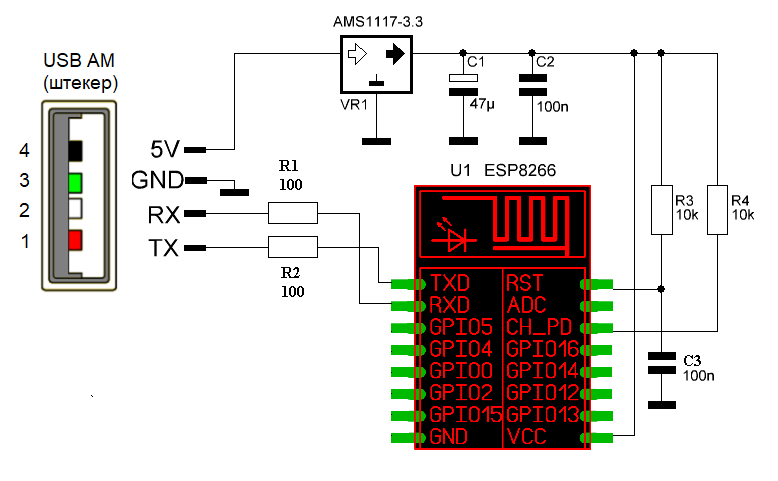

# TCL-TAC-07-WiFi

Данный проект представляет собой замену стандартной сетевой карты (wi-fi модуля) для кондиционеров семейтсва TCL TAC-07(09,12)CHSA/TPG с возможностью управления через WEB и MQTT.

Аппаратное обеспечение
------------------------

Устройство основано MCU ESP8266. В оригинале был использован модуль ESP-12E.

В этих кондиционерах сделана ужасная распиновка разъема wifi модуля, поэтому на схеме сразу изображен USB разьем, видно что к чему подключается.

Схема:



Программное обеспечение
------------------------

ПО предназначено для компилирования с помощью компилятора arduino.

Предварительно нужно исправить параметры в начале файла TCL_Conditioner.ino. Там задаются параметры подключения к wifi, mqtt брокеру и тд.

Внешний вид web интерфейса:


MQTT:
------------------------

Через MQTT реализовано управление и получение состояния ряда параметров:

- ac_power - Питание кондиционера
- current_temperature - Поддерживаемя температура
- target_temperature  - Температура в помещении
- ac_mode - Режим работы
- fan_mode - Режим вентилятора
- swing_mode - Режим качания шторок
- ac_turbo - Режим Турбо

Для каждого параметра есть 3 темы set - установка параметра; get - получение значения параметра; real - данные, полученные с кондиционера. 
Исключение - current_temperature. В начале всегда стоит значение переменной main_topic.

Полный список тем:

```
[main_topic]/set_target_temperature
[main_topic]/set_ac_power
[main_topic]/set_ac_mode
[main_topic]/set_fan_mode
[main_topic]/set_swing_mode
[main_topic]/set_ac_turbo

[main_topic]/get_target_temperature
[main_topic]/get_ac_power
[main_topic]/get_ac_mode
[main_topic]/get_fan_mode
[main_topic]/get_swing_mode
[main_topic]/get_ac_turbo

[main_topic]/real_current_temperature

[main_topic]/real_ac_power
[main_topic]/real_target_temperature
[main_topic]/real_ac_mode
[main_topic]/real_fan_mode
[main_topic]/real_swing_mode
[main_topic]/real_ac_turbo

```

Возможные значения параметров:

ac_power:
 - 0 - "ВЫКЛ"
 - 1 - "ВКЛ"

target_temperature:
 целое число от 16 до 31 (*C)

ac_mode
 - 0 - "ВЫКЛ"
 - 1 - "Автоматический"
 - 2 - "Охлаждение"
 - 3 - "Нагрев"
 - 4 - "Только вентилятор"
 - 5 - "Осушение"

fan_mode
 - 1 - "ВЫКЛ"
 - 2 - "Автоматический"
 - 3 - "Минимум"
 - 4 - "Средний"
 - 5 - "Выше среднего"
 - 6 - "Максимальный"
 - 7 - "Режим "Focus"
 - 8 - "Режим "Diffuse"
 - 9 - "Режим "Quiet"

swing_mode
 - 0 - "ВЫКЛ"
 - 1 - "Качение в обоих плоскостях"
 - 2 - "Вертикальное качение"
 - 3 - "Горизонтальное качение"

ac_turbo
 - 0 - "ВЫКЛ"
 - 1 - "ВКЛ"
